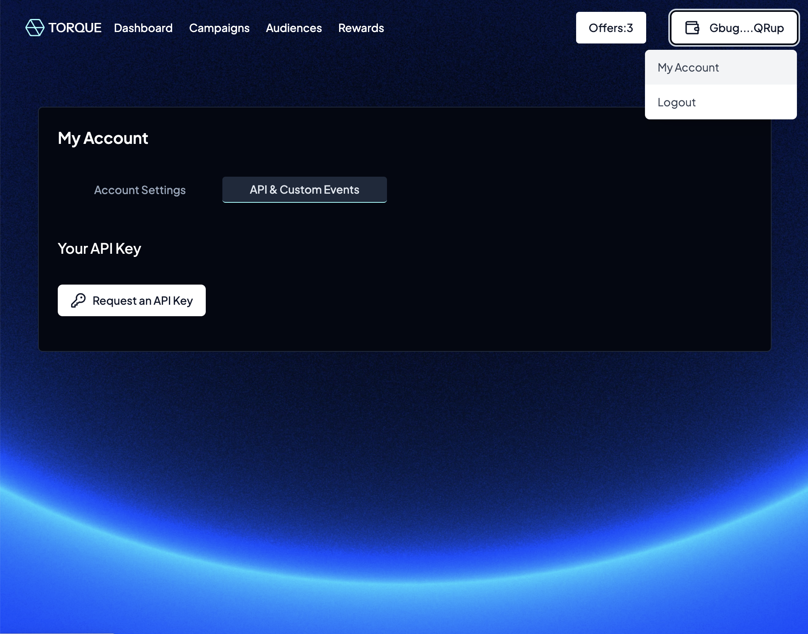
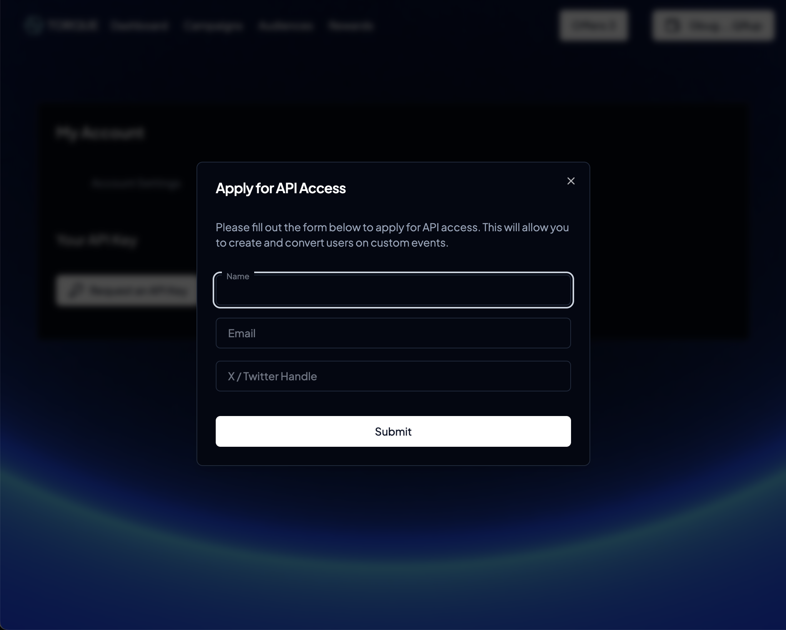

# Requesting an API key

To use offchain actions for your campaigns/offers, you need to request an API key from the Torque. An API key is required for your custom events to be accepted by the Torque API.

To request an API key, first, log into the [Torque app](https://app.torque.so) and navigate to "My Account" section by clicking the wallet/address button in the top right corner and then clicking "My Account". Once you are on the "My Account" page, click on the "API & Custom Events" tab and then click the "Request API Key" button. Once clicked, you will be prompted to enter your email where we can contact you to set up your account.

<figure><figcaption>
My Account screen
</figcaption></figure>

<figure><figcaption>
API Request Form
</figcaption></figure>

###
