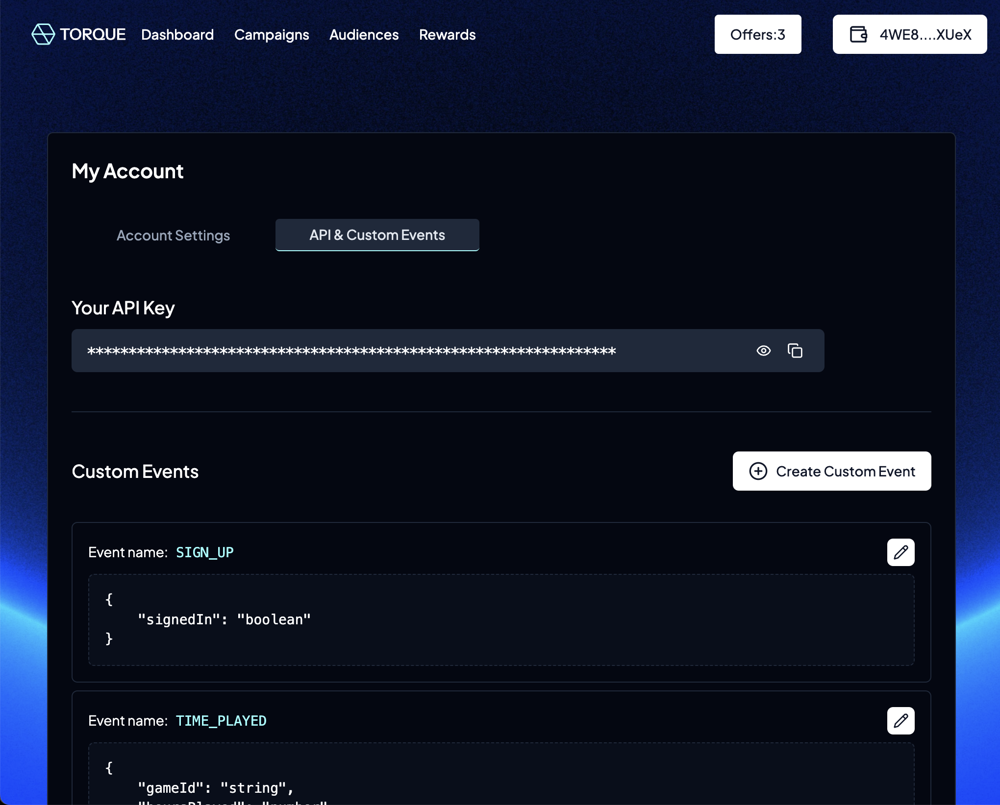

# Creating Offchain Actions

<figure><figcaption>
My Account page with API Key
</figcaption></figure>

### Creating an offchain action

Once you have an API key, you are able to create offchain actions from the **"My Account"** page. To create an offchain action, select the **"API & Offchain Actions"** tab and then click the **"Create offchain action"** button. This will open a form where you can enter the name of your custom event (this will be used to identify your custom events in the Torque app), and the parameters that you want to include in your event. For example, if you want to convert a user on the order of a product, you can include the item ID, order amount, and whether the user is a premium user or not.

<figure><figcaption>
Create Event Form
</figcaption></figure>

<figure><figcaption>
Create Event Form - Populated
</figcaption></figure>

**NOTE:** It is important to note that that a custom event can be used across multiple campaigns/offers, with different validation rules for each one. With our example above, you can create a requirement for a specific product purchase by matching on the item ID, and also create another requirement in a separate campaign/offer for purchases above a certain value by setting a minimum on the order amount.

### Editing a custom event

To edit a custom event, click on the "Edit" (Pencil icon) button next to the custom event you want to edit. This will open the same form where you can update the name and parameters of your event.

