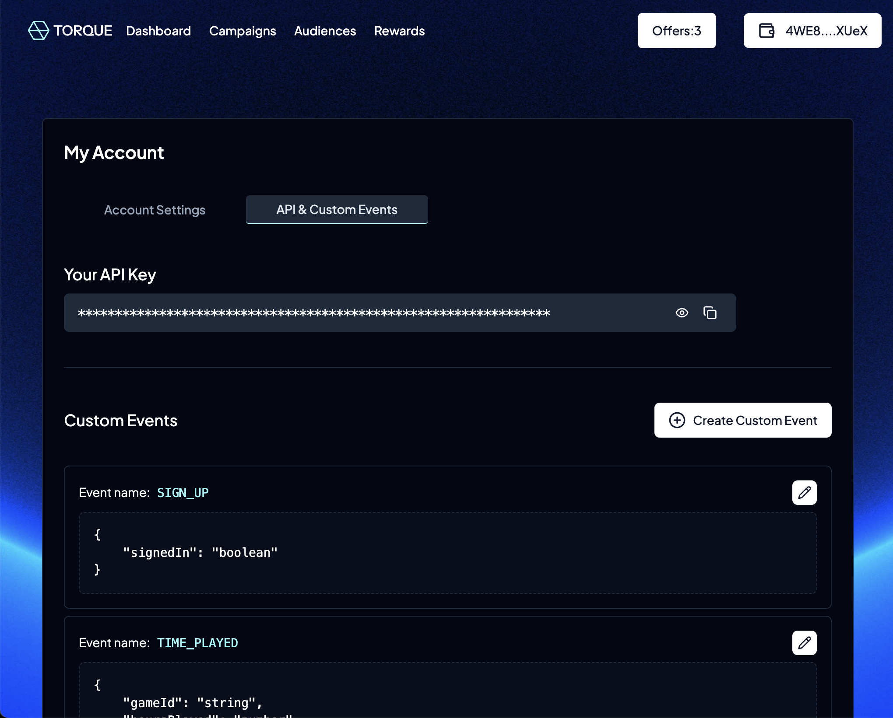

# Offchain Actions

Offchain actions allow you to create custom requirements for your campaigns/offers by giving you the ability to use your own data through a webhook and validate the requirements for each user.&#x20;

Once configured, this lets you send a `POST` request with your configured action data to the Torque API from any source, such as a website, a mobile app, or a third-party API. The main benefit of this is that it allows you to integrate your Torque offer requirements with on-chain and off-chain events in a way that is easy to manage and maintain.

<figure><figcaption>
My Account - API &#x26; Custom Events
</figcaption></figure>
